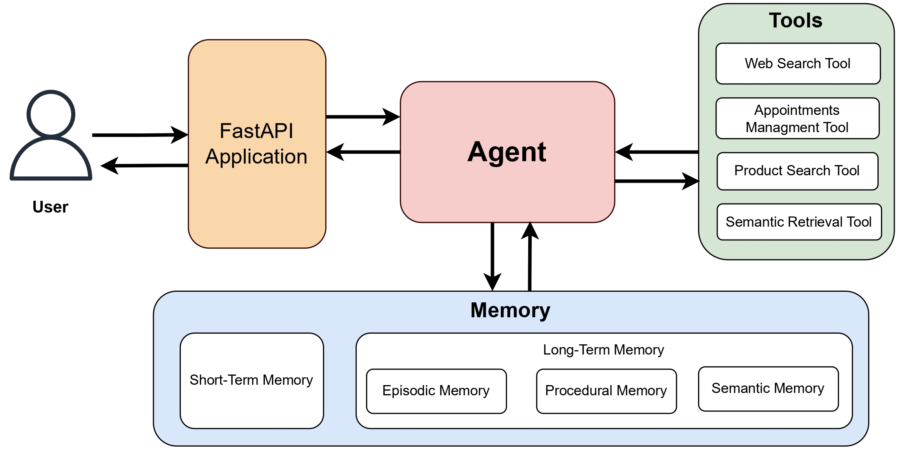

# 🤖 Dexter - Conversational AI Agent

## 01. Introduction

Dexter is a production-ready open-source AI agent backend designed for enterprise applications. It integrates four human-like memory types, short-term and long-term (episodic, semantic, and procedural) to deliver contextual, adaptive, and personalized interactions. Going beyond typical chatbots, Dexter combines LLM reasoning with persistent memory, and intelligent tool use to handle complex conversations.

**[Read more about AI agent memory](https://dashankadesilva.medium.com/agentic-memory-how-ai-agents-learn-remember-and-improve-fd683c344685)**.



### [Detailed System Architecture ->](docs/Detailed_system.png)

## 02. Motivation

The motivation to build Dexter AI agent stems from the belief that conversational AI should feel more human-like - capable of adapting, remembering, learning from experience, and providing increasingly personalized assistance over time.

**Primary Use Cases:**
- **Customer Support Services**: AI agents that remember customer history, preferences, and previous issues for more personalized support
- **Personal Assistants**: Virtual assistants that learn user preferences, habits, and communication styles over time
- **Healthcare Applications**: AI systems that maintain patient interaction history while respecting privacy requirements
- **Educational Platforms**: Tutoring systems that adapt to individual learning styles and track long-term progress
- **Business Process Automation**: Intelligent agents that can handle complex, multi-step business workflows with memory of process states
- **Research Assistance**: AI helpers that can maintain context across long research projects and remember relevant findings

## 03. Key Features

### Memory Systems
- **Short-term Memory**: Maintains conversation context within sessions
- **Semantic Memory**: Stores and retrieves factual knowledge from conversations
- **Episodic Memory**: Remembers specific interactions and experiences
- **Procedural Memory**: Learns successful patterns and strategies over time

### Tool Integration
- **Product Search**: Find products with smart filtering and recommendations
- **Appointment Management**: Schedule, modify, and track appointments
- **Semantic Retrieval**: Query stored knowledge and past conversations
- **Extensible Architecture**: Easy to add custom tools for specific needs

### Personalized Experience
- **User Preferences**: Learns and remembers individual user preferences
- **Context Awareness**: Understands conversation flow and references
- **Adaptive Responses**: Improves responses based on successful interactions
- **Multi-session Continuity**: Maintains knowledge across multiple conversations

## 04. Core Components

- **ReAct Agent**: The main reasoning engine that processes queries and coordinates responses
- **Memory Manager**: Orchestrates all memory systems and provides unified context
- **Tool Router**: Intelligently selects and executes appropriate tools
- **Memory Systems**: Four specialized memory types for comprehensive context management

## 05. Quick Start

### Prerequisites & Technology Stack

* Python 3.11 or higher
* MongoDB 5.0+ (data storage) and Pinecone (vector storage)
* OpenAI API key (language processing)
* **Core**: LangChain/LangGraph, FastAPI, OpenAI GPT-4  
* **Memory**: MongoDB (episodic/procedural), Pinecone (semantic vectors), Redis (short-term)  
* **Infrastructure**: Docker, AWS ECS, Prometheus/Grafana monitoring  
* **Testing**: Pytest, LangSmith tracing, comprehensive test coverage  

### Installation
```bash
# Clone and setup
git clone https://github.com/yourusername/dexter-conversational-ai-agent.git
cd dexter-conversational-ai-agent
cp .env.example .env

# Configure your .env file with API keys
# See docs/DEPLOYMENT.md for detailed configuration

# Start with Docker (recommended)
docker-compose up -d

# Or run locally
pip install -r requirements.txt
python -m uvicorn app.main:app --reload --port 8000
```

### Try It Out
```bash
# Create a session
curl -X POST "http://localhost:8000/api/v1/sessions" \
     -H "Content-Type: application/json" \
     -d '{"user_id": "user123"}'

# Chat with Dexter
curl -X POST "http://localhost:8000/api/v1/chat" \
     -H "Content-Type: application/json" \
     -d '{
       "message": "Find me wireless headphones under $100",
       "session_id": "your_session_id",
       "user_id": "user123"
     }'
```
Your Dexter agent will be running (locally) at `http://localhost:8000` and you can try using **Postman**.


## 06. Usage Examples: 
Please refer [Usage Examples](docs/USAGE_EXAMPLES.md) to see how to use different functionalities

## 07. Development

Read more on Contributing, extending tools, testing, and development workflow, please refer to **[Development Guide](docs/DEVELOPMENT.md)**

### 1. Project Structure
```
dexter-conversational-ai-agent/
├── app/
│   ├── agent/              # Core ReAct agent logic
│   ├── api/                # FastAPI endpoints
│   ├── memory/             # Memory system implementations
│   ├── tools/              # Tool implementations
│   └── utils/              # Utility functions
├── tests/                  # Comprehensive test suite
├── docs/                   # Documentation
└── deployment/             # Docker and deployment configs
```
Please refer [Detailed project Structure](docs/project_structure.md) for detailed information.

### 2.Available Tools:

***Product Search Tool***: Perfect for e-commerce and product discovery.
- **Price filtering**: "Find laptops under $1000"
- **Category browsing**: "Show me electronics"
- **Feature search**: "Wireless headphones with noise cancellation"
- **Inventory checking**: "What's available in stock?"

***Appointment Tool***: Comprehensive appointment management.
- **Scheduling**: "Book appointment with Dr. Smith tomorrow at 2 PM"
- **Availability**: "When is Dr. Johnson available next week?"
- **Modifications**: "Reschedule my appointment to Friday"
- **Cancellations**: "Cancel my appointment for tomorrow"

***Semantic Retrieval Tool***: Queries stored knowledge and memories.
- **Fact retrieval**: "What did I say about my dietary preferences?"
- **Context search**: "When did I last book an appointment?"
- **Pattern discovery**: "What products have I been interested in?"

***Web Search Tool***: Search quesy related information in the internet.

### 3. [Adding Custom Tools](docs/USAGE_EXAMPLES.md) to see how to introduce new tools to the agent.

### 4. [Memory System Details](docs/USAGE_EXAMPLES.md) to see how to introduce new tools to the agent.

## 08. Running Tests
```bash
# Run all tests
make test

# Run with coverage
pytest --cov=app --cov-report=html

# Run specific test types
pytest tests/unit/         # Unit tests
pytest tests/integration/  # Integration tests
pytest tests/e2e/         # End-to-end tests
```

## 09. Deployment

### Development
```bash
# Build and run with Docker Compose
make docker-build
make docker-run
```

### Production
```bash
# Use the production Docker Compose
docker-compose -f docker-compose.prod.yml up -d
```

## 10. Documentation

### For more details please refer to our comprehensive documentations
- **[Architecture Guide](docs/ARCHITECTURE.md)** - Dive into memory systems, cognitive design principles, and system architecture
- **[API Reference](docs/API.md)** - Complete API documentation with examples and integration guides  
- **[Deployment Guide](docs/DEPLOYMENT.md)** - Production setup, AWS deployment, monitoring, and configuration
- **[Development Guide](docs/DEVELOPMENT.md)** - Contributing, extending tools, testing, and development workflow


## 11. Monitoring and Observability

Dexter includes comprehensive monitoring capabilities:

- **Performance Metrics**: Response times, tool usage, memory operations
- **Error Tracking**: Detailed error logging and alerting
- **Memory Analytics**: Memory system effectiveness and usage patterns
- **User Analytics**: Conversation flows and user satisfaction metrics

## 12. Security

- **API Authentication**: Token-based authentication for all endpoints
- **Input Validation**: Comprehensive input sanitization and validation
- **Rate Limiting**: Protection against abuse and DoS attacks
- **Data Privacy**: Secure handling of user data and conversations

## 13. Contributing

We welcome contributions! Please see our [Development Guide](docs/DEVELOPMENT.md) for detailed information.

## 14. License

This project is licensed under the MIT License - see the [LICENSE](LICENSE) file for details.

## 15. Acknowledgments

- Built with [FastAPI](https://fastapi.tiangolo.com/) for high-performance APIs
- Powered by [OpenAI](https://openai.com/) for language understanding
- Vector storage by [Pinecone](https://www.pinecone.io/)
- Data persistence with [MongoDB](https://www.mongodb.com/)

---

**Made with ❤️ by [Dashanka De Silva](https://www.linkedin.com/in/dashankadesilva/)**

***Dexter - Because conversations should be intelligent, memorable, and personal.***
