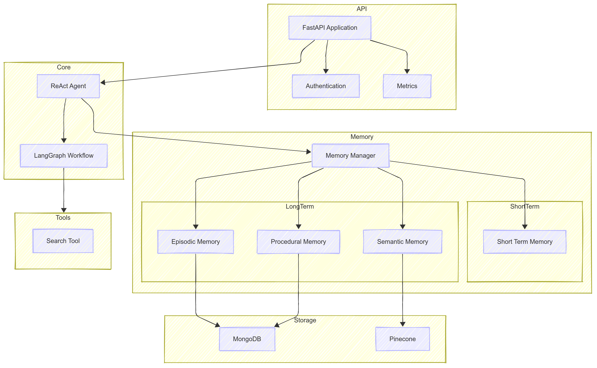

# Dexter v1.0 :AI Agent with Comprehensive Memory Systems

A production-ready ReAct AI agent backend with comprehensive memory management, including short-term (session memory) and long-term memory with semantic, episodic, and procedural components.



## Features

- 🧠 **Comprehensive Memory Systems**:
  - **Short-term/Session Memory**: Maintains conversation context
  - **Long-term Memory Systems**:
    - **Semantic Memory**: Stores factual knowledge using vector embeddings in Pinecone
    - **Episodic Memory**: Records conversation history and interactions in MongoDB
    - **Procedural Memory**: Remembers how to perform tasks and use tools effectively

- 🔍 **ReAct Framework Implementation**: Combines reasoning and action in a cycle that allows the agent to interact with tools

- 🛠️ **Modular Tool Integration**: Easily add and configure tools like internet search

- 🚀 **Production-Ready Architecture**:
  - FastAPI backend with RESTful endpoints
  - Containerized with Docker for easy deployment
  - Monitoring with Prometheus and Grafana dashboards
  - Comprehensive testing suite
  - CI/CD pipeline for AWS deployment

- 📊 **Observability**: Complete logging, metrics, and tracing using LangSmith

## Tech Stack

- **Framework**: LangChain / LangGraph for agent orchestration
- **Memory Storage**:
  - MongoDB for episodic and procedural memory
  - Pinecone for semantic vector storage
- **API**: FastAPI for high-performance REST endpoints
- **Containerization**: Docker and Docker Compose
- **Monitoring**: Prometheus and Grafana
- **Deployment**: AWS ECS via CloudFormation
- **Testing**: Pytest for unit and integration tests
- **CI/CD**: GitHub Actions

## Getting Started

### Prerequisites

- Python 3.11+
- Docker and Docker Compose
- MongoDB (local or hosted)
- Pinecone Account
- OpenAI API Key

### Installation

1. Clone the repository:
   ```bash
   git clone https://github.com/yourusername/ai-agent-with-memory.git
   cd ai-agent-with-memory
   ```

2. Set up environment variables:
   ```bash
   cp .env.example .env
   ```
   Edit the `.env` file with your API keys and configuration.

3. Install dependencies:
   ```bash
   pip install -r requirements.txt
   ```

### Running the Application

#### Using Docker

```bash
docker-compose up
```

#### Development Mode

```bash
uvicorn app.api.main:app --reload
```

### API Endpoints

- `POST /api/chat`: Send a message to the AI agent
- `GET /api/conversations/{conversation_id}`: Retrieve a conversation history
- `DELETE /api/conversations/{conversation_id}`: Delete a conversation
- `GET /health`: Health check endpoint

## Architecture

```
ai_agent_with_memory/
├── app/
│   ├── api/           # FastAPI application and endpoints
│   ├── core/          # Core agent implementation
│   ├── memory/        # Memory systems implementation
│   ├── tools/         # External tools (search, calculator, etc.)
│   └── utils/         # Utility functions
├── deployment/        # Deployment configurations
│   └── aws/           # AWS CloudFormation templates
├── monitoring/        # Monitoring setup
│   ├── grafana/       # Grafana dashboards
│   └── prometheus.yml # Prometheus configuration
├── tests/             # Test suite
├── .env.example       # Example environment variables
├── docker-compose.yml # Docker Compose configuration
├── Dockerfile         # Docker build file
└── requirements.txt   # Python dependencies
```

## Memory Systems Design

### 1. Short-term Memory (Session Memory)

Implemented using LangGraph's built-in state management to maintain the conversation flow within a single session.

### 2. Long-term Memory Systems

#### Semantic Memory
Stores factual knowledge using vector embeddings in Pinecone, enabling semantic search and retrieval of information relevant to user queries.

#### Episodic Memory
Records conversation history and interactions in MongoDB, allowing the agent to recall past interactions with the user.

#### Procedural Memory
Maintains information about how to perform tasks and use tools effectively, implemented as a combination of predefined patterns and learned behaviors from interactions.

## Contributing

Contributions are welcome! Please feel free to submit a Pull Request.

## License

This project is licensed under the MIT License - see the LICENSE file for details.
