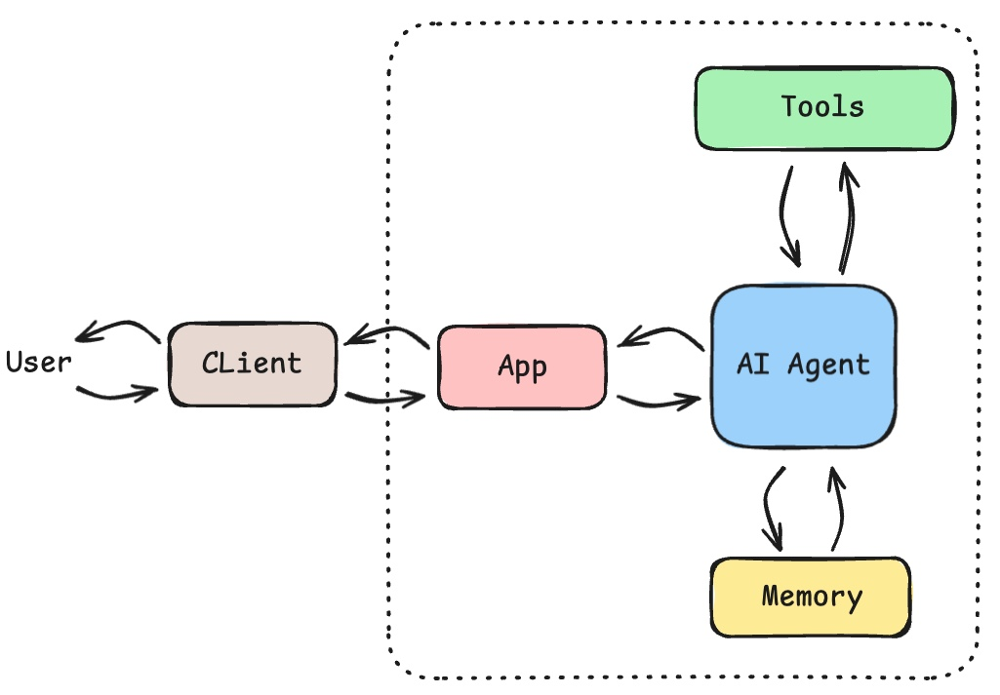
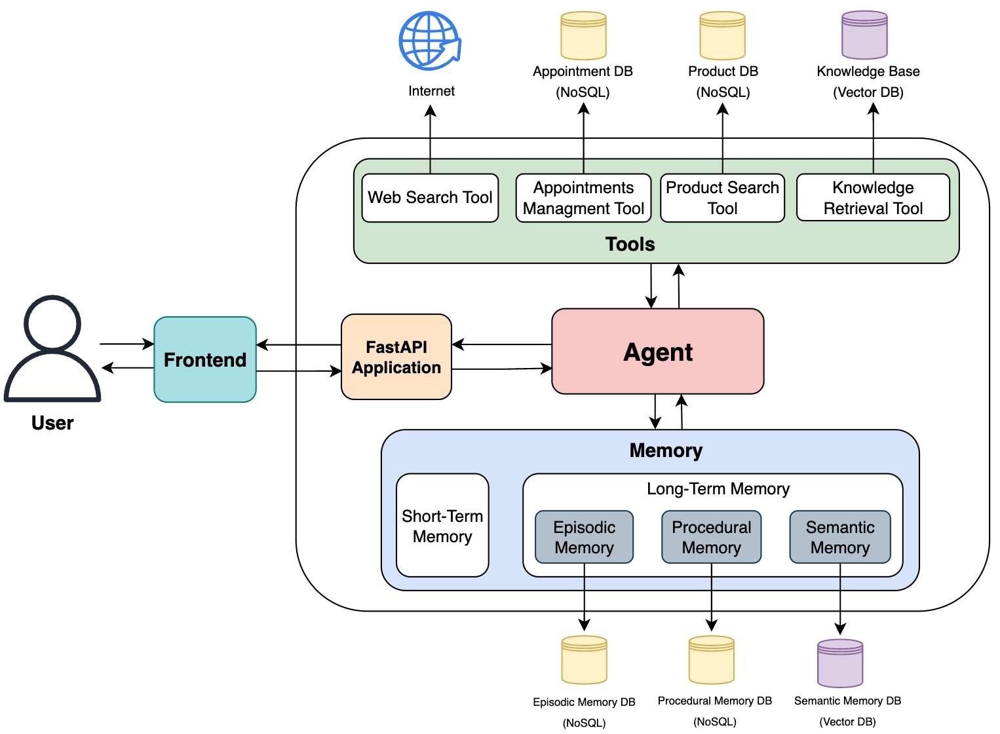

# 🤖 Dexter — Conversational AI Agent for Customer Support Assistance

## Introduction

Dexter is a **production-ready, serverless-first AI agent backend** built for customer support assistance. It blends four **human-like memory systems** with **tool** use and **LLM reasoning** to deliver contextual, adaptive, and personalized conversations. It is designed for **low cold-starts** on **AWS Lambda, efficient memory access, and clean extensibility**. Dexter includes a comprehensive **evaluation system with LLM-as-judge assessment**, enabling continuous quality monitoring and improvement.

**Read more:** [Agentic Memory — how AI agents learn, remember, and improve](https://dashankadesilva.medium.com/agentic-memory-how-ai-agents-learn-remember-and-improve-fd683c344685)



## Motivation

Customer support should feel human: aware of context, able to remember preferences, and capable of improving with every interaction. Dexter focuses on memory, tool-use, and safety to enable trustworthy, high-quality assistance.

## 03. System Architecture

### Core Components

- **ReAct Agent**: Reasoning engine coordinating memory and tools
- **Memory Manager**: Orchestrates short-term, semantic, episodic, procedural memory
- **Tools**: Pluggable actions (product search, appointments, retrieval, web)
- **FastAPI App**: HTTP API exposing chat, memory, and session endpoints

### Memory Systems
- **Short‑term Memory**: Maintains conversation context within a session
- **Semantic Memory**: Retrieves factual knowledge and documents (Pinecone)
- **Episodic Memory**: Remembers specific past interactions (MongoDB)
- **Procedural Memory**: Reinforces successful strategies over time (MongoDB)

### Tooling & Integrations
- **Product Search**: Smart filtering and recommendations
- **Appointment Management**: Scheduling, availability, updates, cancellations
- **Semantic Retrieval**: Search knowledge and conversation history
- **Web Search**: Fetch relevant external context when needed
- **Extensible Tool Router**: Add custom domain tools easily

### Developer Experience
- **Serverless-first**: AWS Lambda + API Gateway with Mangum
- **Lazy Initialization**: Cold-start optimized app boot for Lambda
- **Optional Metrics**: Prometheus-style metrics exposed at `/metrics`
- **Comprehensive Tests**: Pytest suite and utilities
- **Evaluation System**: LLM-as-judge evaluation with 130 test cases, automated quality assessment, and Prometheus metrics



See also: **[Detailed System Architecture](docs/Detailed_system.png)**

## Quick Start

### Prerequisites & Tech Stack

- **Python**: 3.11+
- **Datastores**: MongoDB (episodic/procedural), Pinecone (semantic vectors)
- **LLM Provider**: OpenAI API key
- **Core**: FastAPI, Mangum, Pydantic
- **Infra**: Docker (local), AWS Lambda + API Gateway (prod)
- **Testing**: Pytest

### Install & Run (Local)
```bash
# Clone and enter the project
git clone https://github.com/yourusername/dexter-conversational-ai-agent.git
cd dexter-conversational-ai-agent

# Install dependencies
pip install -r requirements.txt

# Start the API (dev)
uvicorn app.api.main:app --reload --host 0.0.0.0 --port 8000
```

Or use Docker Compose:
```bash
make docker-build
make docker-run
# Stop: make docker-down
```

### Try It Out
```bash
# Health
curl http://localhost:8000/health

# Chat with Dexter
curl -X POST "http://localhost:8000/chat" \
     -H "Content-Type: application/json" \
     -d '{
       "message": "Find me wireless headphones under $100",
       "session_id": null,
       "conversation_id": null,
       "user_id": "user123"
     }'

# Query memories (semantic/episodic/procedural)
curl -X POST "http://localhost:8000/memories/query" \
     -H "Content-Type: application/json" \
     -d '{
       "user_id": "user123",
       "memory_type": "semantic",
       "query": "discount policy",
       "limit": 5
     }'
```

## API Overview

- **GET** `/health` — service health
- **POST** `/chat` — send a message, get agent response
- **POST** `/conversations/create_new` — create a conversation for a user
- **GET** `/conversations/{user_id}` — list recent conversations
- **GET** `/conversations/{user_id}/{conversation_id}` — fetch a specific conversation
- **POST** `/memories/query` — query semantic/episodic/procedural memories
- **POST** `/session/{session_id}/reset` — reset short‑term memory

Note: When `ENABLE_METRICS=true`, Prometheus metrics are exposed at **`/metrics`**.

## Development

See the **[Development Guide](docs/DEVELOPMENT.md)** for setup, extending tools, testing, and best practices.

### Project Structure
```
dexter-conversational-ai-agent/
├── app/
│   ├── agent/              # Core ReAct agent logic
│   ├── api/                # FastAPI endpoints (incl. lazy-init app)
│   ├── memory/             # Memory system implementations
│   ├── tools/              # Tool implementations
│   └── utils/              # Utility functions
├── evaluation/             # Agent evaluation system
│   ├── datasets/           # Benchmark test cases (130 cases)
│   ├── results/            # Evaluation results and reports
│   └── *.py                # Evaluation engine, metrics, reports
├── tests/                  # Comprehensive test suite
├── docs/                   # Documentation
├── monitoring/             # Prometheus & Grafana configs
└── deployment/             # Lambda container & deployment scripts
```
Please refer [Detailed project Structure](docs/project_structure.md) for detailed information.

### 2. Available Tools:

***Product Search Tool***: Perfect for e-commerce and product discovery.
- **Price filtering**: "Find laptops under $1000"
- **Category browsing**: "Show me electronics"
- **Feature search**: "Wireless headphones with noise cancellation"
- **Inventory checking**: "What's available in stock?"

***Appointment Tool***: Comprehensive appointment management.
- **Scheduling**: "Book appointment with Dr. Smith tomorrow at 2 PM"
- **Availability**: "When is Dr. Johnson available next week?"
- **Modifications**: "Reschedule my appointment to Friday"
- **Cancellations**: "Cancel my appointment for tomorrow"

***Semantic Retrieval Tool***: Queries stored knowledge and memories.
- **Fact retrieval**: "What did I say about my dietary preferences?"
- **Context search**: "When did I last book an appointment?"
- **Pattern discovery**: "What products have I been interested in?"

***Web Search Tool***: Search quesy related information in the internet.

### 3. [Adding Custom Tools](docs/USAGE_EXAMPLES.md) to see how to introduce new tools to the agent.

### 4. [Memory System Details](docs/USAGE_EXAMPLES.md) to see how to introduce new tools to the agent.

### Makefile Essentials
```bash
# Run tests
make test

# Local dev (uvicorn on :8000)
make dev

# Docker workflow
make docker-build
make docker-run
make docker-down

# Lambda local build & run (uses Docker, linux/amd64)
make lambda-build
make lambda-run            # pass ENV_FILE=.env.lambda if needed
make lambda-invoke-health  # curl http://localhost:9000/2015-03-31/functions/function/invocations
```

## Deployment (Serverless‑First)

Dexter is optimized for **AWS Lambda + API Gateway** using a Lambda container image. The app uses **Mangum** to translate API Gateway events into ASGI for FastAPI, with **lazy initialization** to reduce cold-starts.

### Lambda Container
- Image base: `public.ecr.aws/lambda/python:3.11`
- Entrypoint: `app/lambda_handler.py` → `lambda_handler`
- App module (lazy-init): `app/api/main_lazy_init.py`

Build and test locally:
```bash
make lambda-build
make lambda-run           # exposes RIE at :9000
# In a separate shell, invoke health
make lambda-invoke-health
```

### Deploy
- Use `deployment/scripts/` for automated ECR push and stack updates
- See `deployment/aws/cloudformation.yml` and `deployment/aws/lambda_api.yml`
- Configure secrets via Lambda env vars or AWS Secrets Manager

ECS/ALB instructions remain in docs for reference but are deprecated in favor of Lambda. If you still need ECS, review `docs/DEPLOYMENT.md` and `.github/workflows/` and adapt accordingly.

## Monitoring & Observability

- **Default**: CloudWatch Logs (Lambda)
- **Optional**: Prometheus/Grafana for local or containerized deployments
  - App metrics available at `/metrics` when `ENABLE_METRICS=true`
  - Example configs under `monitoring/`

## Agent Evaluation & Quality Assurance

Dexter includes a comprehensive evaluation system to assess and monitor agent performance across multiple dimensions.

### Evaluation System Features

- **Benchmark Datasets**: 130 test cases covering all agent capabilities
  - 100 comprehensive test cases (product search, appointments, knowledge retrieval, web search)
  - 20 edge cases (ambiguous queries, error handling, safety boundaries)
  - 10 multi-turn conversation scenarios
- **LLM-as-Judge**: Automated quality assessment using GPT-3.5-turbo
  - 13 evaluation dimensions (relevance, accuracy, tool usage, safety, etc.)
  - Weighted scoring with configurable thresholds
  - Detailed reasoning for each score
- **Prometheus Metrics**: 15 custom metrics for real-time monitoring
  - Quality scores, pass rates, tool usage, latency tracking
  - Metrics server on port 9091
- **Comprehensive Reports**: Detailed analysis with markdown reports
  - Per-case results, aggregate statistics, failure analysis
  - Comparison reports across multiple evaluation runs

### Quick Start: Run Your First Evaluation

```bash
# Test with 5 cases (quick verification)
python evaluation/run_evaluation.py --dataset benchmark_v1 --max-cases 5 --verbose

# Run full benchmark (100 cases, ~30-45 minutes)
python evaluation/run_evaluation.py --dataset benchmark_v1

# Run edge cases
python evaluation/run_evaluation.py --dataset edge_cases

# Start metrics server (separate terminal)
python evaluation/metrics_server.py
```

### View Evaluation Results

```bash
# List recent evaluations
python evaluation/run_evaluation.py --list-results

# View detailed report
cat evaluation/results/report_benchmark_v1_*.md

# Compare multiple runs
python evaluation/run_evaluation.py --compare benchmark_v1 edge_cases
```

### Evaluation Metrics in Prometheus

The evaluation system exposes custom metrics that integrate with your existing Prometheus setup:

```yaml
# Already configured in monitoring/prometheus.yml
scrape_configs:
  - job_name: 'ai_agent_evaluation'
    static_configs:
      - targets: ['localhost:9091']
```

Key metrics include:
- `agent_evaluation_pass_rate` - Pass rate by category
- `agent_tool_success_rate` - Success rate per tool
- `agent_response_quality_score` - Quality scores by dimension
- `agent_tool_latency_seconds` - Tool execution latency

### Documentation

- **Full Guide**: [`evaluation/README.md`](evaluation/README.md) - Complete reference
- **Quick Start**: [`evaluation/GETTING_STARTED.md`](evaluation/GETTING_STARTED.md) - First-time setup
- **Quick Reference**: [`evaluation/QUICK_REFERENCE.md`](evaluation/QUICK_REFERENCE.md) - Command cheat sheet

### Expected Results (First Run)

- **Pass Rate**: 70-85%
- **Average Quality Score**: 7.0-8.5 out of 10
- **Common Areas for Improvement**: Tool selection (80-90%), parameter extraction (75-85%)

The evaluation system helps you:
- ✅ Establish performance baselines
- ✅ Track quality trends over time
- ✅ Identify areas for improvement
- ✅ Validate changes before deployment
- ✅ Monitor production-like scenarios

## Security

- **Secrets**: Prefer AWS Secrets Manager for `OPENAI_API_KEY`, `PINECONE_API_KEY`, `MONGODB_URI`
- **Least Privilege**: Scope IAM role to only required services
- **Validation**: Pydantic schema validation on inputs
- **Privacy**: Store only what you need; configure retention policies

## Usage Examples

See **[Usage Examples](docs/USAGE_EXAMPLES.md)** for end‑to‑end flows and tool usage.

## Contributing

Contributions are welcome! Please read the **[Development Guide](docs/DEVELOPMENT.md)** and open a PR.

## License

MIT — see **[LICENSE](LICENSE)**.

## Acknowledgments

- Built with [FastAPI](https://fastapi.tiangolo.com/)
- Powered by [OpenAI](https://openai.com/)
- Vector storage by [Pinecone](https://www.pinecone.io/)
- Data persistence with [MongoDB](https://www.mongodb.com/)

---

**Made with ❤️ by [Dashanka De Silva](https://www.linkedin.com/in/dashankadesilva/)**

Dexter — because conversations should be intelligent, memorable, and personal.
