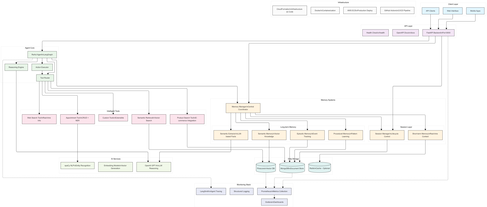

# Architecture Guide

**Note that this documentation is created with partial help of GenAI tools.**

This document provides a comprehensive deep dive into Dexter's system architecture, cognitive memory design principles, and component interactions.

## Table of Contents

- [System Overview](#system-overview)
- [Cognitive Memory Architecture](#cognitive-memory-architecture)
- [ReAct Agent Framework](#react-agent-framework)
- [Tool Ecosystem](#tool-ecosystem)
- [Data Flow & Processing](#data-flow--processing)
- [Performance & Scalability](#performance--scalability)
- [Design Principles](#design-principles)

## System Overview

Dexter's architecture is built around the concept of persistent, intelligent memory systems that mirror human cognitive processes. Unlike traditional stateless AI systems, Dexter maintains contextual awareness across sessions while continuously learning from interactions.

### System Architecture



### Core Components

1. **FastAPI Backend**: High-performance REST API with automatic documentation
2. **ReAct Agent**: Reasoning and action execution framework
3. **Memory Manager**: Central coordinator for all memory operations
4. **Tool Router**: Intelligent tool selection and execution
5. **Storage Layer**: Multi-database architecture for different data types

## Cognitive Memory Architecture

The heart of Dexter lies in its sophisticated memory systems, each designed to handle different aspects of knowledge and experience.

### Memory Types Overview

```
                    ┌─────────────────────────────────┐
                    │        Memory Manager           │
                    │     Central Coordinator         │
                    └─────────┬───────────────────────┘
                              │
                ┌─────────────┼─────────────────────────┐
                │             │                         │
                ▼             ▼                         ▼
    ┌─────────────────┐ ┌─────────────┐ ┌─────────────────────────┐
    │  Short-term     │ │  Session    │ │    Long-term Memory     │
    │   Memory        │ │  Manager    │ │                         │
    └─────────────────┘ └─────────────┘ └─────────────────────────┘
            │                   │                       │
            ▼                   ▼                       ▼
    ┌─────────────────┐ ┌─────────────┐ ┌──────────────────────┐
    │   Redis Cache   │ │  MongoDB    │ │  Semantic │ Episodic │
    │  (Real-time     │ │ (Session    │ │  Memory   │ Memory   │
    │   Context)      │ │  Tracking)  │ │ (Pinecone)│(MongoDB) │
    └─────────────────┘ └─────────────┘ └───────────┴──────────┘
                                                     │
                                                     ▼
                                        ┌─────────────────────────┐
                                        │   Procedural Memory     │
                                        │      (MongoDB)          │
                                        └─────────────────────────┘
```

### 1. Session Manager **=CHANGE=**

**Purpose**: Manages the complete lifecycle of user interactions and maintains conversation state.

**Key Responsibilities**:
- Session creation, tracking, and termination
- Activity monitoring and engagement metrics
- Conversation flow analysis
- User preference learning

**Data Structure**:
```python
{
  "session_id": "uuid",
  "user_id": "string",
  "created_at": "timestamp",
  "last_activity": "timestamp",
  "status": "active|ended|timeout",
  "message_count": "integer",
  "tools_used": ["tool_names"],
  "engagement_score": "float",
  "preferences": {
    "communication_style": "string",
    "preferred_response_length": "string",
    "topics_of_interest": ["topics"]
  }
}
```

### 2. Short-term Memory

**Purpose**: Maintains immediate conversation context and working memory for current session.

**Key Characteristics**:
- Redis-based for ultra-fast access
- Automatic expiration (configurable TTL)
- Optimized for frequent read/write operations
- Stores conversation flow and temporary variables

**Use Cases**:
- Maintaining context across message exchanges
- Storing intermediate results from tool executions
- Tracking conversation state and user intent
- Caching frequently accessed information

### 3. Long-term Memory: Semantic Memory

**Purpose**: Stores factual knowledge and conceptual understanding extracted from conversations.

**Implementation**:
- **Semantic Extractor**: Uses GPT-4 to identify and extract meaningful facts
- **Vector Storage**: Pinecone for similarity-based retrieval
- **Knowledge Consolidation**: Transforms conversations into structured knowledge

**Extraction Process**:
```python
def extract_semantic_facts(conversation):
    """Extract meaningful facts using cognitive science principles"""
    # 1. Identify factual statements
    # 2. Extract entities and relationships
    # 3. Determine persistence value
    # 4. Generate vector embeddings
    # 5. Store in knowledge base
```

**Example Semantic Facts**:
```json
{
  "fact_id": "uuid",
  "user_id": "string",
  "content": "User prefers morning appointments",
  "entities": ["user", "appointments", "morning"],
  "confidence": 0.95,
  "source_session": "session_id",
  "created_at": "timestamp",
  "embedding": [0.1, 0.2, ...]
}
```

### 4. Long-term Memory: Episodic Memory

**Purpose**: Records specific conversation events and their temporal relationships.

**Key Features**:
- Chronological event tracking
- Context preservation with emotional tone
- Relationship mapping between events
- Rich querying capabilities

**Event Structure**:
```python
{
  "event_id": "uuid",
  "session_id": "string",
  "user_id": "string",
  "timestamp": "datetime",
  "event_type": "message|tool_use|system_action",
  "content": "string",
  "context": {
    "previous_events": ["event_ids"],
    "emotional_tone": "string",
    "user_satisfaction": "float",
    "resolution_status": "string"
  },
  "metadata": {
    "tool_used": "string",
    "success": "boolean",
    "response_time": "float"
  }
}
```

### 5. Long-term Memory: Procedural Memory

**Purpose**: Learns and stores successful problem-solving strategies and tool usage patterns.

**Learning Mechanism**:
- Monitors tool execution success rates
- Identifies effective strategy patterns
- Stores successful approach templates
- Applies learned strategies to similar situations

**Strategy Pattern Example**:
```python
{
  "pattern_id": "uuid",
  "pattern_type": "appointment_booking",
  "success_rate": 0.92,
  "conditions": {
    "user_request_type": "healthcare_appointment",
    "time_preference": "morning",
    "provider_type": "doctor"
  },
  "strategy": {
    "steps": [
      "extract_provider_name",
      "check_morning_availability",
      "suggest_earliest_slot",
      "confirm_appointment"
    ],
    "tool_sequence": ["appointment_tool"],
    "parameters": {"prefer_early": true}
  },
  "learned_from": ["session_ids"],
  "last_used": "timestamp"
}
```

## ReAct Agent Framework

Dexter implements a sophisticated ReAct (Reasoning + Acting) framework that combines multi-step reasoning with intelligent action execution.

### Agent Processing Flow

```
User Input ──▶ Intent Analysis ──▶ Reasoning Phase ──▶ Action Planning
    │                │                    │                 │
    │                ▼                    ▼                 ▼
    │         Memory Retrieval ──▶ Strategy Selection ──▶ Tool Execution
    │                │                    │                 │
    │                ▼                    ▼                 ▼
    └─────── Response Generation ◀── Memory Update ◀── Result Processing
```

### Reasoning Engine

**Multi-step Problem Decomposition**:
1. **Intent Recognition**: Understand what the user wants to accomplish
2. **Context Assembly**: Gather relevant information from memory systems
3. **Strategy Selection**: Choose approach based on procedural memory
4. **Step Planning**: Break down complex tasks into manageable steps
5. **Execution Monitoring**: Track progress and adapt as needed

**Example Reasoning Process**:  **=CHANGE=**
```
User: "Schedule a checkup with Dr. Smith next week"

Reasoning Steps:
1. Intent: Schedule medical appointment
2. Context: User prefers Dr. Smith, timeframe is "next week"
3. Memory Check: User previously preferred morning appointments
4. Strategy: Use healthcare appointment booking pattern
5. Plan: Extract provider → Check availability → Suggest times → Confirm
```

### Action Execution

**Intelligent Tool Selection**:
- Dynamic tool routing based on intent analysis
- Parameter extraction from natural language
- Error recovery and alternative approaches
- Success tracking for procedural learning

**Tool Execution Pipeline**:
```python
async def execute_tool(tool_name, parameters, context):
    """Execute tool with intelligent error handling"""
    try:
        # 1. Validate parameters
        # 2. Execute tool function
        # 3. Process results
        # 4. Update memory systems
        # 5. Return formatted response
    except Exception as error:
        # Error recovery strategies
        # Alternative tool selection
        # Graceful degradation
```

## Tool Ecosystem  **=UPDATE=**

Each tool in Dexter's ecosystem is designed to understand natural language and handle real-world complexity.

### Product Search Tool

**Advanced NLP Processing**:
- Price range extraction: "under $100", "between $50-200"
- Category classification: electronics, clothing, etc.
- Feature matching: "wireless", "waterproof", "gaming"
- Use case understanding: "for running", "office work"

**Query Processing Pipeline**:
```python
def process_product_query(query):
    # 1. Extract price filters
    # 2. Identify categories
    # 3. Parse feature requirements
    # 4. Clean search text
    # 5. Build database query
    # 6. Rank and format results
```

### Appointment Tool

**Complex NLP Capabilities**:
- Temporal expression parsing: "next Tuesday", "in two weeks"
- Provider name extraction using spaCy NER
- Conflict detection and resolution
- Preference application from memory

**Scheduling Intelligence**:
```python
def schedule_appointment(request, user_context):
    # 1. Parse time expressions
    # 2. Extract provider preferences
    # 3. Check availability
    # 4. Apply user preferences from memory
    # 5. Detect conflicts
    # 6. Suggest optimal times
```

### Semantic Retrieval Tool

**Vector Search Architecture**:
- Pinecone integration for similarity search
- Configurable similarity thresholds
- Context-aware result ranking
- Integration with episodic memory

**Retrieval Process**:
```python
def semantic_search(query, user_context):
    # 1. Generate query embedding
    # 2. Search vector database
    # 3. Filter by user context
    # 4. Rank by relevance
    # 5. Enrich with episodic context
```

## Data Flow & Processing

### Conversation Processing Pipeline

```
User Message ──▶ Intent Analysis ──▶ Memory Retrieval ──▶ Context Assembly
     │               │                    │                    │
     │               ▼                    ▼                    ▼
     │        Tool Selection ──▶ Parameter Extraction ──▶ Tool Execution
     │               │                    │                    │
     │               ▼                    ▼                    ▼
     └─────── Response Generation ◀── Memory Update ◀── Result Processing
```

### Memory Update Flow

1. **Event Recording**: Log conversation event in episodic memory
2. **Fact Extraction**: Use semantic extractor to identify key facts
3. **Pattern Learning**: Update procedural memory with successful strategies
4. **Session Tracking**: Update session metrics and preferences
5. **Context Refresh**: Update short-term memory for next interaction

### Cross-Component Communication

All components communicate through well-defined interfaces:

```python
# Memory Manager Interface
class MemoryManager:
    async def store_event(self, event: ConversationEvent)
    async def retrieve_context(self, user_id: str, query: str)
    async def update_semantic_facts(self, facts: List[SemanticFact])
    async def learn_pattern(self, pattern: StrategyPattern)

# Tool Router Interface  
class ToolRouter:
    async def select_tool(self, intent: str, context: dict)
    async def execute_tool(self, tool: str, params: dict)
    async def handle_error(self, error: Exception, context: dict)
```

## Performance & Scalability

### Optimization Strategies

1. **Memory System Optimization**:
   - Redis for high-speed short-term memory access
   - Connection pooling for database operations
   - Asynchronous processing for memory updates
   - Intelligent caching strategies

2. **Agent Processing**:
   - Parallel tool execution where possible
   - Streaming responses for long operations
   - Request/response optimization
   - Memory-efficient context management

3. **Database Performance**:
   - MongoDB indexing for episodic queries
   - Pinecone optimization for vector searches
   - Connection pooling and reuse
   - Query optimization and caching

### Scalability Considerations

- **Horizontal Scaling**: Stateless agent design allows multiple instances
- **Load Balancing**: Round-robin distribution across agent instances
- **Database Sharding**: User-based partitioning for large scale
- **Caching Layers**: Multi-level caching for frequently accessed data

## Design Principles

### 1. Memory System Foundation

All memory systems are based on established cognitive memory concepts:
- **Episodic Memory**: Based on Tulving's episodic memory model
- **Semantic Memory**: Implements semantic network theory
- **Procedural Memory**: Follows skill acquisition and automation principles
- **Working Memory**: Implements Baddeley's working memory model

### 2. Modularity and Extensibility

- **Pluggable Architecture**: Easy to add new tools and memory components
- **Interface-Based Design**: Clean separation between components
- **Configuration-Driven**: Behavior modification without code changes
- **Event-Driven Updates**: Loose coupling between components

### 3. Production Readiness

- **Error Recovery**: Graceful handling of failures at all levels
- **Monitoring Integration**: Comprehensive metrics and observability
- **Security**: Authentication, authorization, and data protection
- **Performance**: Optimized for real-world usage patterns

### 4. Learning and Adaptation

- **Continuous Learning**: System improves with each interaction
- **User Personalization**: Adapts to individual user preferences
- **Strategy Evolution**: Refines approaches based on success patterns
- **Context Awareness**: Leverages historical context for better responses

This architecture enables Dexter to provide truly intelligent, contextual, and personalized conversational AI experiences while maintaining production-grade reliability and performance.
