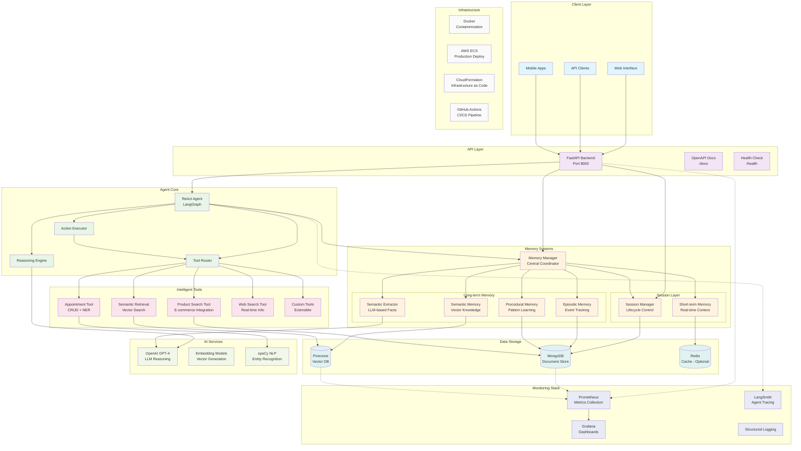
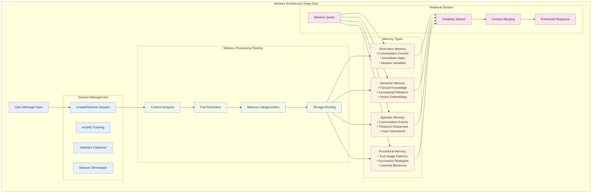
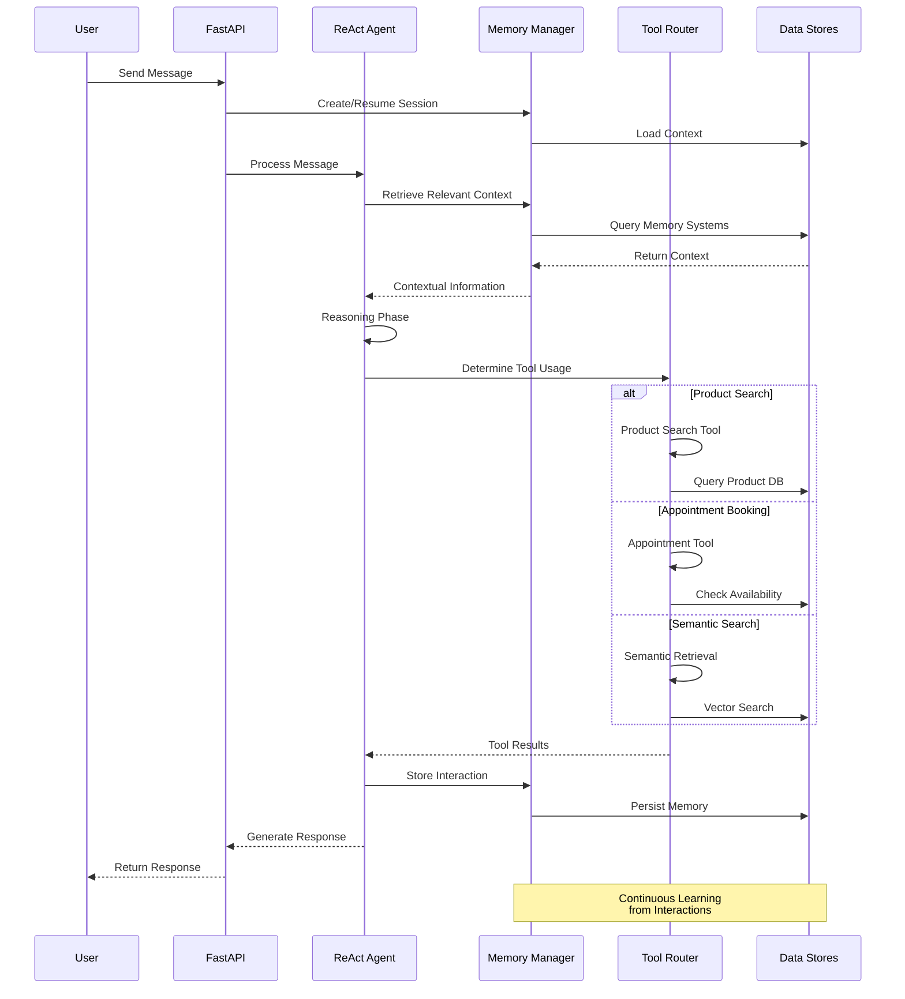
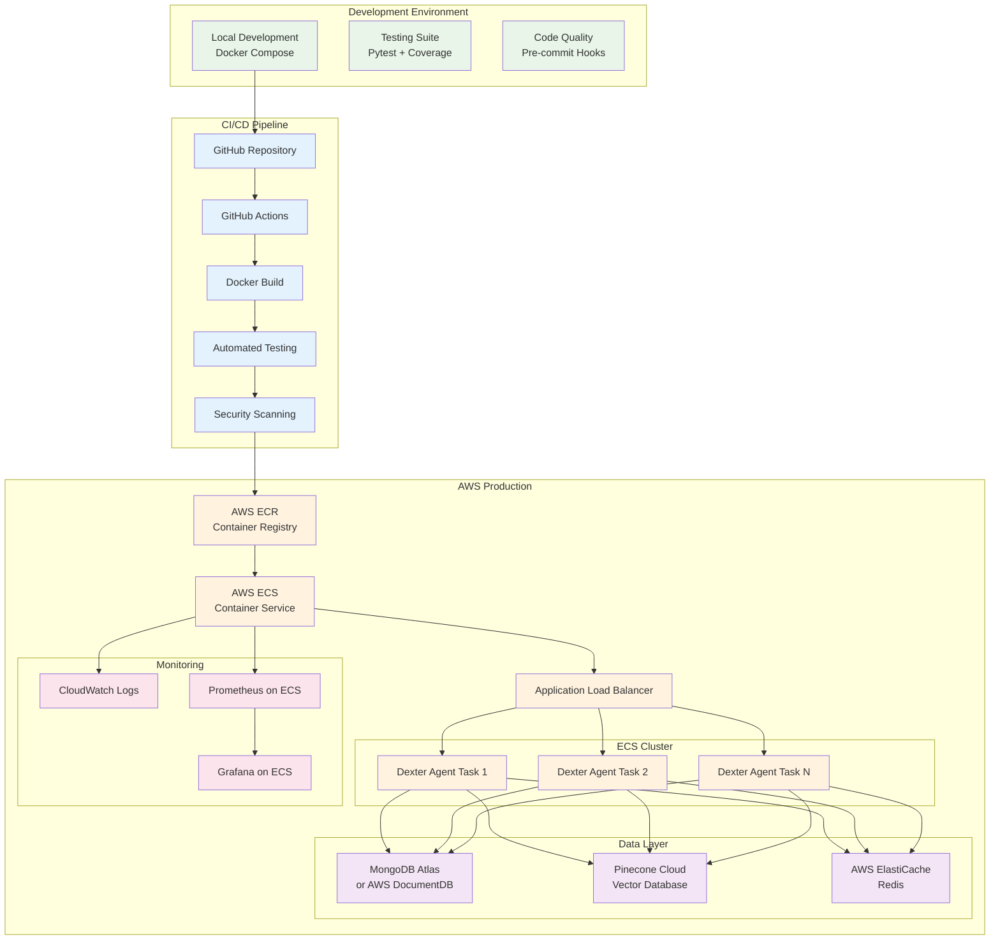

# Dexter AI Agent - System Architecture Diagram

This document contains the Mermaid diagram code for visualizing the complete system architecture of the Dexter conversational AI agent.

## Complete System Architecture

## Memory System Detail View

## Tool Integration Flow

## Deployment Architecture

